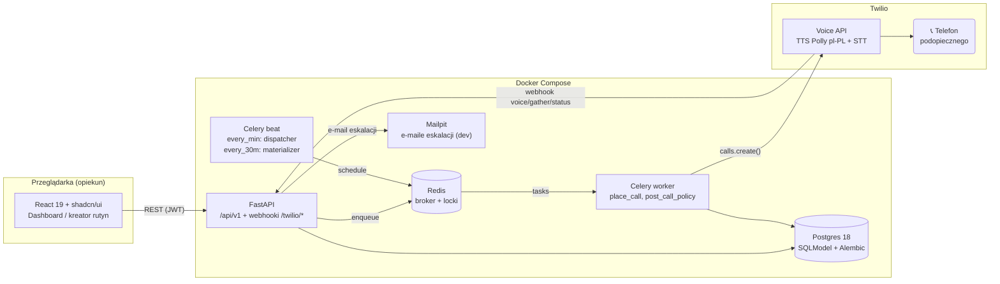
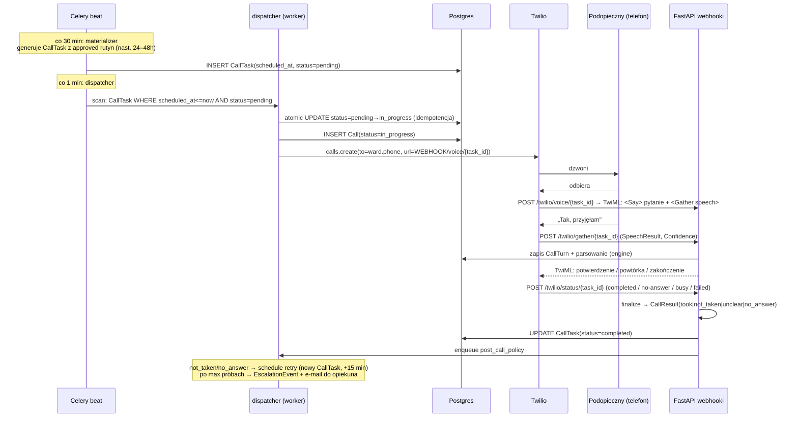

# 02 — Architektura

> Baza: fork **full-stack-fastapi-template** (FastAPI + SQLModel + Alembic + Postgres, React 19 + Vite + TanStack + shadcn/ui, Traefik, Mailpit, Docker Compose, JWT auth gotowe).
> Doklejamy: **Celery + Redis (broker/scheduler) + Twilio Voice (TTS/STT)**. Nie zmieniamy reszty — czas jest złotem.

## Diagram komponentów



## Cykl życia połączenia (serce systemu)



**Dlaczego webhooki trafiają do FastAPI, a nie do workera:** Twilio potrzebuje publicznego URL odpowiadającego TwiML-em natychmiast; FastAPI to robi, a cięższe rzeczy (polityka, eskalacja) oddaje do Celery.

## Publiczny URL — warunek konieczny

Twilio MUSI mieć dostęp do FastAPI przez HTTPS. Dwie ścieżki:

| Wariant | Kiedy | Uwagi |
|---|---|---|
| **A. Deploy wcześnie** (FastAPI Cloud — template ma support — albo VPS z `compose.deploy.yml`) | **Rekomendowany**: deploy do T+8h | Stabilny URL, mniej ryzyka na demo. Webhook = `https://domena/api/v1/twilio/...` |
| **B. Tunel lokalny** (ngrok / cloudflared) | Fallback i szybki start | URL może się zmienić po restarcie tunelu → po restarcie aktualizować `PUBLIC_BASE_URL` i konfigurację webhooków Twilio. `ngrok http 8000` |

Konfiguracja: jedna zmienna `PUBLIC_BASE_URL` używana do sklejania URL-i webhooków przy `calls.create()`.

## Bezpieczeństwo webhooków

- Wszystkie endpointy aplikacji: JWT (z template).
- Webhooki `/api/v1/twilio/*`: **walidacja podpisu Twilio** (`X-Twilio-Signature` przez `twilio-python` → `RequestValidator`), NIE JWT.
- ⚠️ Pułapka za proxy (Traefik/ngrok): validator rekonstruuje URL z requestu — musi zgadzać się z URL-em podanym do Twilio (protokół + host). Jeśli proxy gubi nagłówki `X-Forwarded-Proto/Host`, walidacja fałszywie failuje → na hackathon dopuszczalny przełącznik `TWILIO_VALIDATE_SIGNATURE` (default: on; off tylko przy debugowaniu proxy, nigdy na produkcji demo).
- Webhooki odpowiadają **bez autoryzacji opiekuna** — `task_id` w URL jest UUID-em (niezgadywalny).

## Stack — co dokładnie doklejamy

| Element | Wybór | Gdzie |
|---|---|---|
| Kolejka | Celery 5 + Redis 7 (broker + result backend + locki) | `backend/pyproject.toml`, `compose.override.yml` (dodać usługę `redis`) |
| Scheduler | Celery beat (2 wpisy: dispatcher 60 s, materializer 30 min) | `backend/app/worker.py`, `celery_app.py` |
| Voice | `twilio` (python SDK) — `calls.create`, TwiML w responsach webhooków | `backend/app/twilio/` |
| TTS | Twilio `<Say voice="Polly.Ewa" language="pl-PL">` (alternatywy: `Polly.Mewi`, `Polly.Jacek`) | TwiML |
| STT | Twilio `<Gather input="speech" language="pl-PL" hints="tak, nie, przyjąłem, przyjęłam, nie wiem">` | TwiML |
| E-mail eskalacji | Istniejący stack `emails` + Mailpit (dev) — reuse z template | `app/utils.py` / `backend/app/mail` |
| Frontend | React 19 + TanStack Router/Query + shadcn/ui; klient z `openapi-ts` (regeneracja po zmianie API!) | `frontend/` |
| Baza | Postgres 18 (istnieje) + migracje Alembic | `backend/app/alembic/versions/` |

## Zmienne środowiskowe (dodatkowe do `.env`)

| Zmienna | Przykład | Opis |
|---|---|---|
| `TWILIO_ACCOUNT_SID` | `ACxxxx...` | z konsoli Twilio |
| `TWILIO_AUTH_TOKEN` | `...` | z konsoli Twilio (też do walidacji podpisu) |
| `TWILIO_FROM_NUMBER` | `+48xxxxxxxxx` | numer nadawcy z Twilio (trial: po zakupie darmowego numeru) |
| `PUBLIC_BASE_URL` | `https://abc123.ngrok-free.app` | baza URL-i webhooków podawanych Twilio |
| `TWILIO_VALIDATE_SIGNATURE` | `true` | wyłączyć tylko przy debugu proxy |
| `CELERY_BROKER_URL` | `redis://redis:6379/0` | w compose |
| `CALL_RETRY_DELAY_MIN` | `15` | polityka retry |
| `CALL_MAX_ATTEMPTS` | `2` | łącznie max prób per CallTask-rutyna |

## Struktura katalogów (docelowa, backend)

```
backend/app/
├── models.py                  # + Ward, Medication, Routine, RoutineItem,
│                              #   RoutineDependency, CallTask, Call, CallTurn,
│                              #   CallResult, EscalationEvent
├── api/routes/
│   ├── wards.py               # CRUD podopiecznych (bez leków — patrz medications)
│   ├── medications.py         # katalog leków (baza leków, read-only, wyszukiwarka)
│   ├── routines.py            # CRUD rutyn + approve
│   ├── calls.py               # listy wyników, szczegóły, test-call
│   └── twilio.py              # webhooki voice/gather/status (bez JWT!)
├── twilio/
│   ├── client.py              # wrapper na Twilio REST
│   ├── engine.py              # ConversationEngine (interfejs z 06-call-flow.md)
│   └── twiml.py               # budowanie odpowiedzi TwiML
└── worker/
    ├── celery_app.py          # app + beat schedule
    ├── tasks.py               # place_call, finalize_call, post_call_policy
    ├── dispatcher.py          # skan CallTask due (lock Redis)
    └── materializer.py        # rutyny → CallTask (nast. 24–48h)
```
