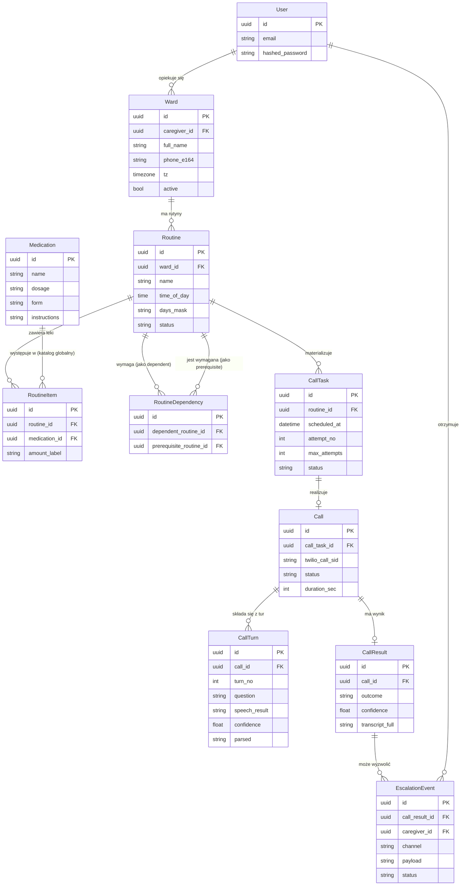
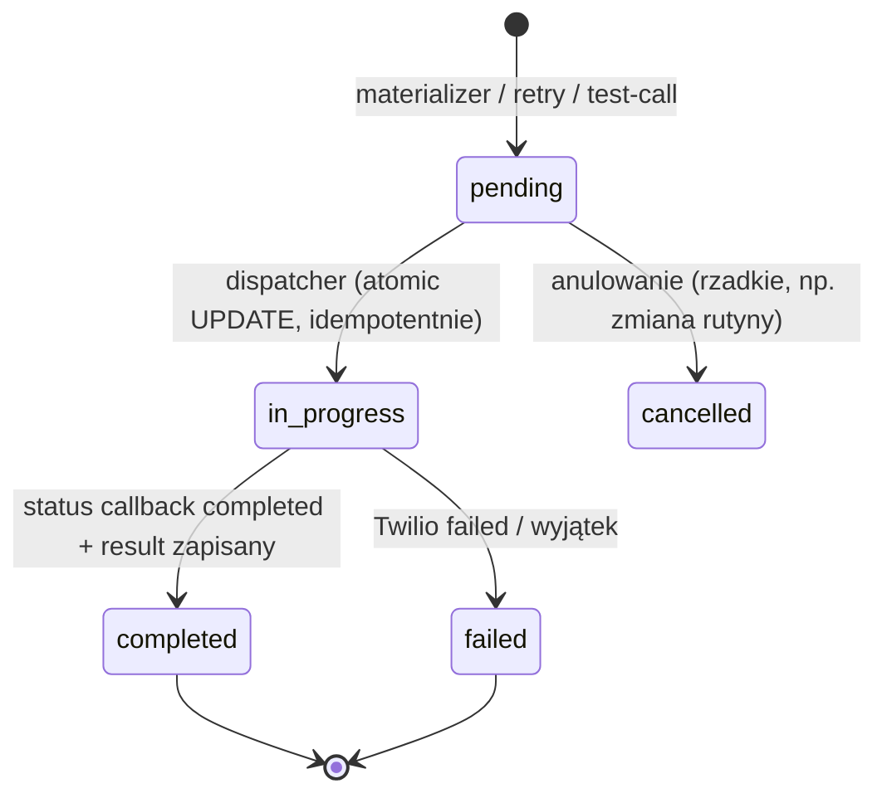
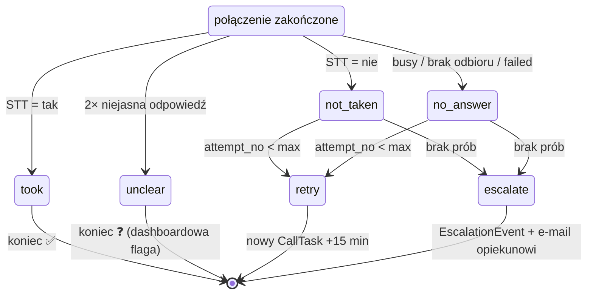

# 03 — Model danych

> SQLModel (z template). Wszystkie tabele z UUID pk, timestampami `created_at/updated_at`. Migracje Alembic — **jedna autogenerowana migracja** na cały MVP (oszczędność czasu), opisana na końcu.

## ERD

## Encje szczegółowo

### Ward (podopieczny)
| Pole | Typ | Uwagi |
|---|---|---|
| `caregiver_id` | FK → User | opiekun; widzi tylko swoje (Filtr CRUD: `WHERE caregiver_id == current_user.id`) |
| `full_name` | str | „Halina Kowalska" |
| `phone_e164` | str | **format E.164**: `+48600100200`. Walidacja regexem przy zapisie |
| `tz` | str | default `Europe/Warsaw`; materializer liczy `scheduled_at` w tej strefie |
| `active` | bool | soft-delete; nieaktywny → materializer pomija |

### Medication — katalog globalny („baza leków")
`name` (str), `dosage` (str, np. „5 mg"), `form` (str, opcj., np. „tabletki powlekane"), `instructions` (str, opcj., np. „po posiłku").

- **Bez `ward_id`** — katalog jest **współdzielony przez wszystkich opiekunów**, read-only w MVP (tylko seed).
- Ward **nie ma** listy leków: podopieczny łączy się z lekami **wyłącznie przez rutyny** (RoutineItem → Medication).
- Zasilanie: skrypt seedujący (20–50 popularnych leków); docelowo Rejestr Produktów Leczniczych — patrz [`09-roadmap.md`](09-roadmap.md).

### Routine (rutyna/plan)
| Pole | Typ | Uwagi |
|---|---|---|
| `ward_id` | FK → Ward | |
| `name` | str | „Poranne leki" |
| `time_of_day` | time | `09:00` — w strefie podopiecznego |
| `days_mask` | str | MVP: `daily`. Format zarezerwowany: `MO,TU,WE` (post-MVP) |
| `status` | enum | **`draft` / `approved` / `paused`** — zatwierdzenie bramkuje schedulowanie (M5) |

### RoutineItem — lek w rutynie
`routine_id`, `medication_id`, `amount_label` (np. „1 tabletka").

### RoutineDependency — zależności między rutynami
`dependent_routine_id` wymaga `prerequisite_routine_id` (przykład z briefu: „musi przyjąć coś innego przed").
- MVP: zapis + walidacja przy approve (nie można zatwierdzić B, jeśli A nie istnieje/nie jest approved) + wyświetlenie w UI.
- Runtime enforcement (np. rozmowa informuje „czy wziął Pan też lek X?") = post-MVP.

### CallTask — zaplanowane zadanie połączenia
| Pole | Typ | Uwagi |
|---|---|---|
| `routine_id` | FK → Routine | snapshot potrzebnych danych czytany przy wywołaniu |
| `scheduled_at` | datetime (UTC) | materializer lub polityka retry |
| `attempt_no` | int | 1..`max_attempts` |
| `max_attempts` | int | default z configu (`CALL_MAX_ATTEMPTS`) |
| `status` | enum | patrz state machine niżej |

### Call — wykonane połączenie
`call_task_id`, `twilio_call_sid` (unikalne), `status` (Twilio: `in-progress/completed/busy/failed/no-answer/canceled`), `duration_sec`, opcj. `recording_url` (C4).

### CallTurn — tura rozmowy (transkrypcja obowiązkowa!)
| Pole | Typ | Uwagi |
|---|---|---|
| `call_id` | FK → Call | |
| `turn_no` | int | 1, 2, … |
| `question` | str | tekst, który system wypowiedział (TTS) |
| `speech_result` | str | surowa transkrypcja z Twilio STT |
| `confidence` | float | 0..1 z Twilio |
| `parsed` | enum | `yes/no/unclear` — wynik parsowania engine'a |

### CallResult — wynik (output „wziął czy nie?")
`call_id` (1:1), `outcome` enum: **`took` / `not_taken` / `unclear` / `no_answer`**, `confidence`, `transcript_full` (pełny tekst do szybkiego podglądu), `notes` (opcj.).

### EscalationEvent — eskalacja
`call_result_id`, `caregiver_id` (odbiorca), `channel` (`email`/`sms`), `payload` (JSON: treść), `status` (`pending/sent/failed`).

## State machine — CallTask

## State machine — wynik i polityka (skrót, szczegóły w 07)

## Plan migracji

1. Dodać modele do `app/models.py` (dziedziczenie jak User/Item w template).
2. `alembic revision --autogenerate -m "care routine call engine"` → **przejrzeć wygenerowany plik** (autogenerate bywa ślepy na enumy).
3. `alembic upgrade head` lokalnie + w dockerze.
4. Regeneracja klienta FE: `bun run generate-client` (skrypt z template) — po ZMIANACH w API, nie po samych modelach.

## Indeksy (dla dispatchera — ważne)

- `CallTask(status, scheduled_at)` — skan co minutę.
- `Call(twilio_call_sid)` unique — webhooki statusu deduplikują.
- `Routine(ward_id)`, `CallTask(routine_id)`, `Medication(name)` (wyszukiwarka katalogu), `Call(ward_id — denormalizacja lub join przez task)`.
